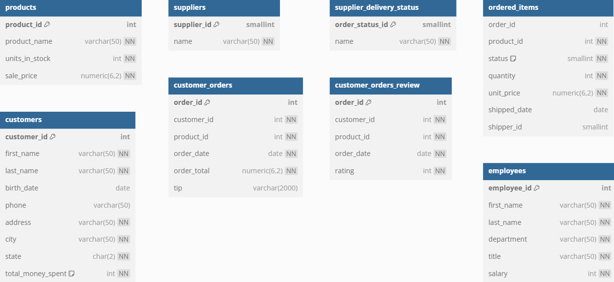

# BUỔI 1

## Cài đặt môi trường PostgreSQL

Cài đặt PostgreSQL trên máy tính của bạn. 
- Bạn có thể tải xuống từ trang chính thức của PostgreSQL: [PostgreSQL Downloads](https://www.postgresql.org/download/).
- Làm theo hướng dẫn cài đặt cho hệ điều hành của bạn (Windows, macOS, Linux).
- Trong quá trình cài đặt, hãy nhớ ghi lại tên người dùng và mật khẩu bạn đã tạo cho tài khoản quản trị viên (thường là `postgres`).

## Setup dữ liệu mẫu cho buổi học
- Dữ liệu mẫu sẽ được sử dụng trong buổi học này là một cơ sở dữ liệu về cửa hàng bánh ngọt (bakery). Có các bảng như sau:

- Mở PGAdmin, trong giao diện chính, tạo một cơ sở dữ liệu mới với tên `bakery`.
- Chọn cơ sở dữ liệu `bakery` vừa tạo, sau đó mở tab "Query Tool".
- Sao chép và dán đoạn mã SQL của file `bakery-db.sql` vào cửa sổ truy vấn. Link file: [bakery-db.sql](./bakery-db.sql)