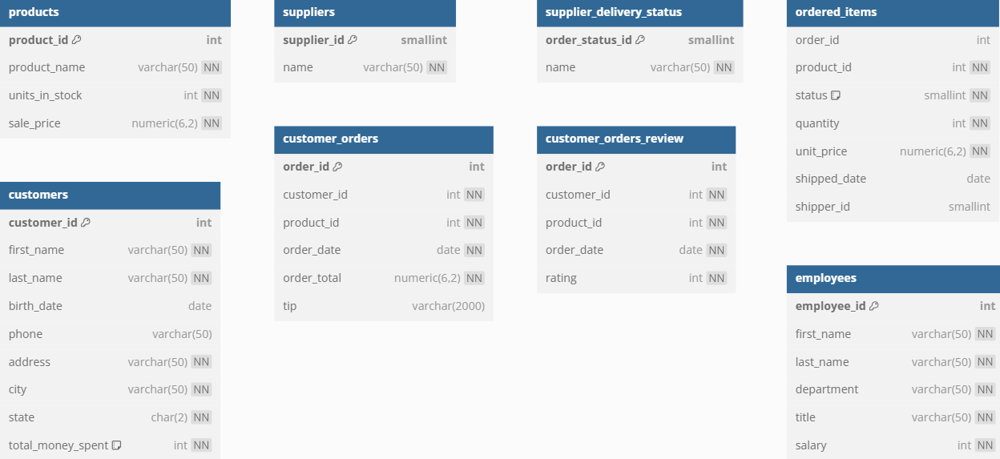

# BUỔI 1 - GIỚI THIỆU VỀ SQL VÀ CÁC CÂU LỆNH CƠ BẢN

## CÀI ĐẶT MÔI TRƯỜNG PostgreSQL

Cài đặt PostgreSQL trên máy tính của bạn. 
- Bạn có thể tải xuống từ trang chính thức của PostgreSQL: [PostgreSQL Downloads](https://www.postgresql.org/download/).
- Làm theo hướng dẫn cài đặt cho hệ điều hành của bạn (Windows, macOS, Linux).
- Trong quá trình cài đặt, hãy nhớ ghi lại tên người dùng và mật khẩu bạn đã tạo cho tài khoản quản trị viên (thường là `postgres`).

## SETUP DỮ LIỆU MẪU CHO BUỔI HỌC
- Dữ liệu mẫu sẽ được sử dụng trong buổi học này là một cơ sở dữ liệu về cửa hàng bánh ngọt (bakery). Có các bảng như sau:

- Mở PGAdmin, trong giao diện chính, tạo một cơ sở dữ liệu mới với tên `bakery`.
- Chọn cơ sở dữ liệu `bakery` vừa tạo, sau đó mở tab "Query Tool".
- Sao chép và dán đoạn mã SQL của file `bakery-db.sql` vào cửa sổ truy vấn. Link file: [bakery-db.sql](https://drive.google.com/file/d/1tRD8o8ugWq6KmqnCDLphhC94ITB5-_3e/view?usp=sharing)

## SCRIPT THỰC HÀNH
1. SELECT ... FROM cơ bản:
```sql
-- Lấy tất cả các sản phẩm
SELECT * FROM products;

-- Lấy danh sách tên và giá bán của sản phẩm
SELECT product_name, sale_price FROM products;

-- Lấy tên sản phẩm, giá bán và giá sau khi giảm 10%
SELECT 
    product_name, 
    sale_price, 
    sale_price * 0.9 AS discounted_price
FROM 
    products;
```

2. WHERE để lọc dữ liệu:
```sql
-- Lấy các sản phẩm còn nhiều hơn 50 đơn vị trong kho
SELECT * FROM products WHERE units_in_stock > 50;

-- Lấy thông tin khách hàng ở thành phố Scranton
SELECT * FROM customers WHERE city = 'Scranton';
```

3. SELECT với các toán tử logic
- Sử dụng AND, OR
```sql
-- Sản phẩm có giá từ $1 đến $3 VÀ còn hơn 100 sản phẩm trong kho
SELECT * 
FROM products 
WHERE sale_price BETWEEN 1 AND 3 
  AND units_in_stock > 100;

-- Khách hàng ở Texas (TX) HOẶC Pennsylvania (PA)
SELECT *
FROM customers
WHERE state = 'TX' OR state = 'PA';
```
- Sử dụng NOT
```sql
-- Khách hàng KHÔNG đến từ Texas (TX) hoặc California (CA)
SELECT *
FROM customers
WHERE state NOT IN ('TX', 'CA');

```

4. SELECT với IN, BETWEEN
- Toán tử IN được dùng để kiểm tra xem giá trị của một cột có nằm trong một danh sách các giá trị được chỉ định hay không. Đây là cách viết tắt hiệu quả cho nhiều điều kiện OR
- 
```sql
-- Lấy các sản phẩm có mã là 1001, 1003 hoặc 1005
SELECT * FROM products WHERE product_id IN (1001, 1003, 1005);

-- Lấy các đơn hàng có tổng tiền từ 10 đến 50
SELECT * FROM customer_orders WHERE order_total BETWEEN 10 AND 50;

-- Lấy các nhân viên thuộc phòng 'Bakery' hoặc 'Marketing'
SELECT * FROM employees WHERE department IN ('Bakery', 'Marketing');
```

- Toán tử BETWEEN dùng để chọn các giá trị trong một khoảng nhất định. Các giá trị này có thể là số, văn bản hoặc ngày tháng. Nó bao gồm cả giá trị bắt đầu và kết thúc của khoảng.
```sql
-- Lấy các đơn hàng có tổng tiền từ 10 đến 50
SELECT * FROM customer_orders WHERE order_total BETWEEN 10 AND 50;

-- Để lấy tất cả các đơn hàng được đặt trong quý đầu tiên của năm 2020:
SELECT
    order_id,
    customer_id,
    order_date,
    order_total
FROM
    customer_orders
WHERE
    order_date BETWEEN '2020-01-01' AND '2020-03-31';
```

5. SELECT với LIKE
- Trong SQL, LIKE là một toán tử được sử dụng trong mệnh đề WHERE để tìm kiếm một mẫu (pattern) cụ thể trong một cột dữ liệu văn bản. Nó rất hữu ích khi bạn không biết chính xác chuỗi ký tự cần tìm.
- Toán tử LIKE sử dụng các ký tự đại diện
- Ký tự đại diện:
  - `%`: đại diện cho bất kỳ chuỗi ký tự nào (bao gồm cả chuỗi rỗng).
  - `_`: đại diện cho một ký tự đơn lẻ.
- Ví dụ:
  - `LIKE 'abc%'`: tìm kiếm các chuỗi bắt đầu bằng "abc".
  - `LIKE '%xyz'`: tìm kiếm các chuỗi kết thúc bằng "xyz".
  - `LIKE '%abc%'`: tìm kiếm các chuỗi chứa "abc" ở bất kỳ vị trí nào.
  - `LIKE 'a_c'`: tìm kiếm các chuỗi có "a" ở đầu, "c" ở cuối và một ký tự bất kỳ ở giữa.
  
```sql
-- Lấy các sản phẩm có tên bắt đầu bằng 'Ch'
SELECT * FROM products WHERE product_name LIKE 'Ch%';

-- Lấy khách hàng có họ kết thúc bằng 'son'
SELECT * FROM customers WHERE last_name LIKE '%son';

-- Lấy các sản phẩm có tên chứa từ 'Cake'
SELECT * FROM products WHERE product_name LIKE '%Cake%';

-- Sản phẩm KHÔNG có từ 'Cookie' trong tên
SELECT *
FROM products
WHERE product_name NOT LIKE '%Cookie%';

```

## BÀI TẬP
Link bài tập: [Bài tập Buổi 1](https://forms.gle/9JwXXDwZwhWeggxo9)
